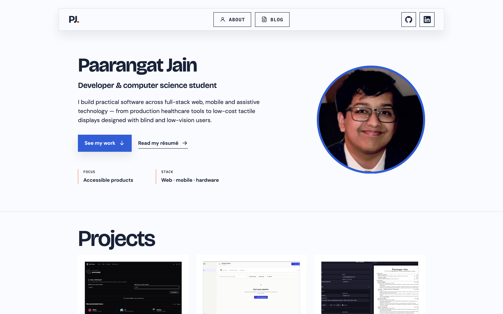

# Paarangat Jain — Portfolio

A responsive personal portfolio showcasing my work across full-stack web, mobile and assistive technology.



## Overview

The site presents selected projects, technical skills, professional experience, blog posts and contact details. It is built with SvelteKit and fully prerendered as a static site, with no server runtime or analytics.

The [Aditya Tripathi portfolio repository](https://github.com/aditya04tripathi/aditya04tripathi) was used as inspiration for this portfolio's structure and presentation.

## Technology

- Svelte 5 and SvelteKit
- Vite 7
- mdsvex for Markdown blog posts
- SvelteKit static adapter
- JavaScript
- Modern CSS with custom properties
- Bricolage Grotesque, DM Sans and IBM Plex Mono

## Features

- Responsive layouts for desktop and mobile
- Persistent light and dark themes
- Project data managed from a single content module
- Filesystem-based home, blog and error routes
- Markdown blog posts with frontmatter, tags and draft support
- Accessible landmarks, keyboard navigation, focus states and skip link
- Downloadable résumé and links to live projects and source code
- Contact form that opens the visitor's email application with the message pre-filled

## Local development

Install the dependencies:

```bash
npm install
```

Start the development server:

```bash
npm run dev
```

Vite will print the local URL in the terminal, usually `http://localhost:5173`.

## Available commands

```bash
npm run dev      # Start the development server
npm run check    # Run Svelte and JavaScript diagnostics
npm run build    # Prerender the production site
npm run preview  # Preview the production build locally
```

## Project structure

```text
src/
├── lib/
│   ├── components/        Reusable Svelte components
│   ├── data/content.js    Projects, experience and technology data
│   └── posts.js           Blog post discovery and metadata helpers
├── posts/                 Markdown blog posts
├── routes/                SvelteKit pages and layouts
│   ├── blog/[slug]/       Individual blog post route
│   ├── blog/              Blog index
│   ├── +error.svelte      Error page
│   ├── +layout.svelte     Shared site layout
│   └── +page.svelte       Home page
├── app.css                Global styles and design tokens
└── app.html               HTML document template
static/
├── images/                Project screenshots and portrait
├── .htaccess              Apache clean-URL and error rules
└── Paarangat-Jain-Resume.pdf
svelte.config.js           SvelteKit, mdsvex and static adapter configuration
vite.config.js             Vite configuration
```

## Content updates

Update projects, experience and technology content in `src/lib/data/content.js`. Place new images in `static/images/` and reference them with paths beginning with `/images/`.

### Writing a blog post

Add a Markdown file to `src/posts/`. Its file name becomes the URL slug: `src/posts/my-post.md` is available at `/blog/my-post`.

Each post requires `title`, `date` and `summary` frontmatter. Tags and draft status are optional:

```yaml
---
title: My post
date: 2026-08-19
summary: A short description used on the blog index.
tags: [SvelteKit, Accessibility]
draft: false
---
```

Posts are sorted newest first. Drafts appear during local development and are excluded from production builds.

## Deployment

Create the static production build:

```bash
npm run build
```

Deploy the generated `build/` directory to any static hosting provider. All routes are prerendered, and `404.html` is generated as the fallback page. The included `static/.htaccess` provides clean URLs when hosting with Apache.

## Accessibility

The interface targets WCAG 2.2 AA, including semantic landmarks, visible keyboard focus, suitable colour contrast, reduced-motion support and appropriately sized interactive targets.

---

© 2026 Paarangat Jain
